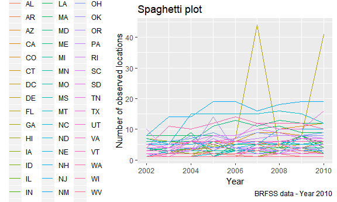
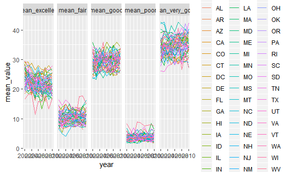
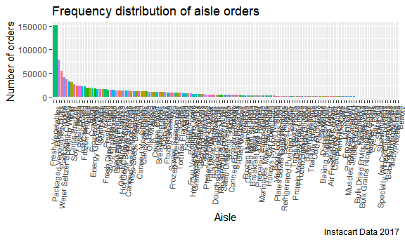
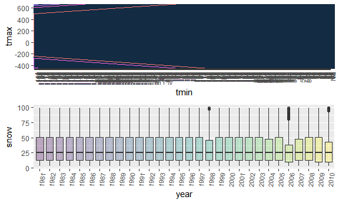

Homework 3
================
Jyoti Ankam
October 7, 2018

``` r
knitr::opts_chunk$set(
  fig.width = 6,
  fig.asp = .6,
  out.width = "90%"
)
```

Loading the tidyverse dataset and formatting the data to use appropriate variable names with a focus on the “Overall Health” topic and including only responses from “Excellent” to “Poor” while organizing responses as a factor taking levels from “Excellent” to “Poor”:

``` r
library(tidyverse)
```

    ## -- Attaching packages --------------------------------------------------- tidyverse 1.2.1 --

    ## v ggplot2 3.0.0     v purrr   0.2.4
    ## v tibble  1.4.2     v dplyr   0.7.4
    ## v tidyr   0.8.0     v stringr 1.3.1
    ## v readr   1.1.1     v forcats 0.3.0

    ## -- Conflicts ------------------------------------------------------ tidyverse_conflicts() --
    ## x dplyr::filter() masks stats::filter()
    ## x dplyr::lag()    masks stats::lag()

``` r
library(p8105.datasets)

library(ggthemes)

library(patchwork)

library(hexbin)

data("brfss_smart2010")
brfss_smart_df = brfss_smart2010 %>% 
  janitor::clean_names() %>% 
  filter(topic == "Overall Health") %>% 
  select(-(class:question), -sample_size, -(confidence_limit_low:geo_location)) %>% 
  mutate(response = forcats::fct_relevel(response, c("Excellent", "Very good", "Good", "Fair", "Poor"))) 
 
brfss_smart_df %>% 
  filter(year == 2002) %>% 
  group_by(locationdesc) %>%
  distinct(locationdesc) %>% 
  summarise(n = n()) %>% 
  filter(n == 7) %>% 
  knitr::kable()
```

locationdesc n ------------- ---

``` r
brfss_smart_df %>%
  distinct(locationabbr, locationdesc, year) %>% 
  group_by(locationabbr, year) %>% 
  summarise(n = n()) %>% 
  ggplot(aes(x = year, y = n, color = locationabbr)) +
  geom_line() +
  theme(legend.position = "left") +
  labs(
    title = "Spaghetti plot",
    x = "Year",
    y = "Number of observed locations",
    caption = "BRFSS data - Year 2010"
  )
```



``` r
brfss_smart_df %>% 
  filter(year %in% c(2002, 2006, 2010) & locationabbr == "NY") %>% 
  spread(key = response, value = data_value) %>% 
  janitor::clean_names() %>% 
  group_by(locationabbr, year) %>% 
  summarise(n = n(),
            mean = mean(excellent),
            sd = sd(excellent)) %>% 
  knitr::kable()
```

| locationabbr |  year|    n|      mean|        sd|
|:-------------|-----:|----:|---------:|---------:|
| NY           |  2002|    5|  24.04000|  4.486424|
| NY           |  2006|    6|  22.53333|  4.000833|
| NY           |  2010|    9|  22.70000|  3.567212|

``` r
brfss_smart_df %>% 
  spread(key = response, value = data_value) %>% 
  janitor::clean_names() %>% 
  group_by(locationabbr, year) %>% 
  summarise(n = n(),
            mean_excellent = mean(excellent, na.rm = TRUE),
            mean_very_good = mean(very_good, na.rm = TRUE),
            mean_good = mean(good, na.rm = TRUE),
            mean_fair = mean(fair, na.rm = TRUE),
            mean_poor = mean(poor, na.rm = TRUE)) %>%
  gather(key = mean_name, value = mean_value, mean_excellent:mean_poor) %>% 
  ggplot(aes(x = year, y = mean_value, color = locationabbr)) +
  geom_line() +
  facet_grid(~mean_name)
```



Problem 2:

Loading the dataset instacart:

``` r
data("instacart")
```

Calculating the number of aisles, and also which aisles are the ones with the most items ordered from:

``` r
instacart %>% 
  distinct(aisle_id) %>% 
  count()
```

    ## # A tibble: 1 x 1
    ##       n
    ##   <int>
    ## 1   134

``` r
instacart %>%
  group_by(aisle_id, aisle) %>% 
  summarise(number = n()) %>% 
  ungroup() %>% 
  top_n(5, number) %>% 
  arrange(desc(number))
```

    ## # A tibble: 5 x 3
    ##   aisle_id aisle                      number
    ##      <int> <chr>                       <int>
    ## 1       83 fresh vegetables           150609
    ## 2       24 fresh fruits               150473
    ## 3      123 packaged vegetables fruits  78493
    ## 4      120 yogurt                      55240
    ## 5       21 packaged cheese             41699

Make a plot that shows the number of items ordered in each aisle. Order aisles sensibly, and organize your plot so others can read it.

``` r
instacart %>%
  group_by(aisle_id, aisle) %>% 
  summarise(number = n()) %>% 
  arrange(desc(number)) %>%
  mutate(aisle = tools::toTitleCase(aisle)) %>% 
  ggplot(aes(x = reorder(aisle, -number), y = number, fill = aisle)) +
  geom_col() +
  theme(axis.text.x = element_text(angle = 85, hjust = 1, size = 8), 
        legend.position = "none") +
  labs(
    title = "Frequency distribution of aisle orders",
    x = "Aisle",
    y = "Number of orders",
    caption = "Instacart Data 2017"
  )
```


Making a table that shows the most popular item aisles “baking ingredients”, “dog food care”, and “packaged vegetables fruits”:

``` r
instacart %>% 
  select(product_name, aisle) %>% 
  filter(aisle == "baking ingredients" | aisle == "dog food care" | aisle == "packaged vegetables fruits") %>%
  group_by(aisle, product_name) %>% 
  summarise(number = n()) %>% 
  top_n(1, number) %>%
  arrange(desc(number))
```

    ## # A tibble: 3 x 3
    ## # Groups:   aisle [3]
    ##   aisle                    product_name                             number
    ##   <chr>                    <chr>                                     <int>
    ## 1 packaged vegetables fru~ Organic Baby Spinach                       9784
    ## 2 baking ingredients       Light Brown Sugar                           499
    ## 3 dog food care            Snack Sticks Chicken & Rice Recipe Dog ~     30

Make a table showing the mean hour of the day at which Pink Lady Apples and Coffee Ice Cream are ordered on each day of the week; format this table for human readers (i.e. produce a 2 x 7 table)

``` r
instacart %>% 
  filter(product_name == "Pink Lady Apples") %>% 
  group_by(order_dow, product_name) %>% 
  summarise(mean_hour = mean(order_hour_of_day)) %>% 
  spread(key = product_name, value = mean_hour)
```

    ## # A tibble: 7 x 2
    ## # Groups:   order_dow [7]
    ##   order_dow `Pink Lady Apples`
    ##       <int>              <dbl>
    ## 1         0               13.4
    ## 2         1               11.4
    ## 3         2               11.7
    ## 4         3               14.2
    ## 5         4               11.6
    ## 6         5               12.8
    ## 7         6               11.9

``` r
instacart %>% 
  filter(product_name == "Coffee Ice Cream") %>% 
  group_by(order_dow, product_name) %>% 
  summarise(mean_hour = mean(order_hour_of_day)) %>% 
  spread(key = product_name, value = mean_hour)
```

    ## # A tibble: 7 x 2
    ## # Groups:   order_dow [7]
    ##   order_dow `Coffee Ice Cream`
    ##       <int>              <dbl>
    ## 1         0               13.8
    ## 2         1               14.3
    ## 3         2               15.4
    ## 4         3               15.3
    ## 5         4               15.2
    ## 6         5               12.3
    ## 7         6               13.8

Problem 3: Installing the dataset -

``` r
data("ny_noaa")
```

Doing some data cleaning -

``` r
ny_noaa_df = ny_noaa %>% 
  mutate(month = months.Date(date),
         day = chron::days(date),
         year = chron::years(date),
         tmax = as.numeric(tmax))
```

Make a two-panel plot showing the average max temperature in January and in July in each station across years. Is there any observable / interpretable structure? Any outliers?

``` r
ny_noaa_df %>% 
  group_by(id, year, month) %>% 
  summarize(n = n(),
            sum = sum(tmax, na.rm = TRUE),
            mean = mean(tmax, na.rm = TRUE)) %>% 
  filter(month %in% c("January", "July")) %>% 
  ggplot(aes(x = year, y = mean, color = id)) +
  facet_grid(~month) + 
  geom_point() +
  theme(axis.text.x = element_text(angle = 85, hjust = 1, size = 8),
        legend.position = "none") +
  viridis::scale_color_viridis(
    name = "location", 
    discrete = TRUE) 
```

    ## Warning: Removed 5970 rows containing missing values (geom_point).



Make a two-panel plot showing (i) tmax vs tmin for the full dataset (note that a scatterplot may not be the best option); and (ii) make a plot showing the distribution of snowfall values greater than 0 and less than 100 separately by year.

``` r
my_scatter = ggplot(ny_noaa_df, aes(x = tmin, y = tmax, color = id)) +
  geom_hex(aes()) +
  theme(axis.text.x = element_text(angle = 85, hjust = 1, size = 8),
      legend.position = "none")

my_data = ny_noaa_df %>% 
  filter(snow > 0 & snow < 100) %>% 
  ggplot(aes(x = year, y = snow, fill = year)) +
  geom_boxplot(alpha = 0.3) +
  theme(axis.text.x = element_text(angle = 85, hjust = 1, size = 8),
        legend.position = "none")

my_scatter / my_data
```

    ## Warning: Removed 1134358 rows containing non-finite values (stat_binhex).


