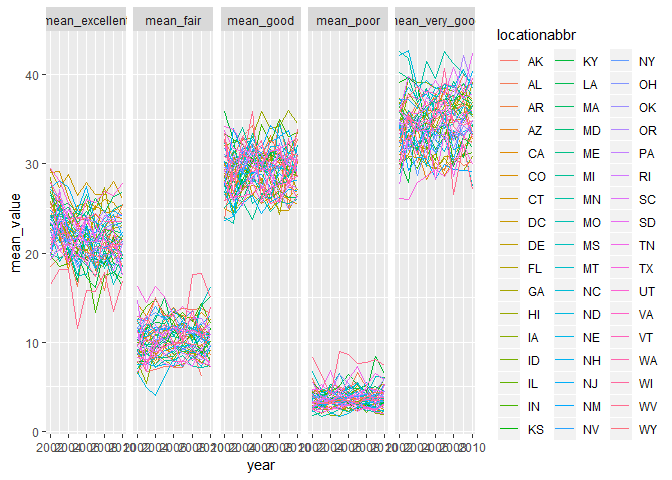
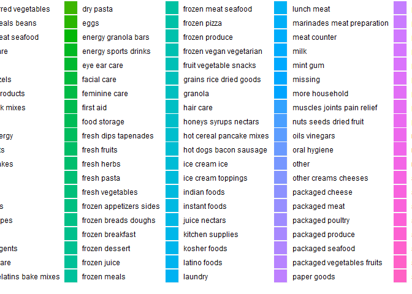

Homework 3
================
Jyoti Ankam
October 7, 2018

Loading the tidyverse dataset and formatting the data to use appropriate variable names with a focus on the “Overall Health” topic and including only responses from “Excellent” to “Poor” while organizing responses as a factor taking levels from “Excellent” to “Poor”:

``` r
library(tidyverse)
```

    ## -- Attaching packages --------------------------------------------------- tidyverse 1.2.1 --

    ## v ggplot2 3.0.0     v purrr   0.2.4
    ## v tibble  1.4.2     v dplyr   0.7.4
    ## v tidyr   0.8.0     v stringr 1.3.1
    ## v readr   1.1.1     v forcats 0.3.0

    ## -- Conflicts ------------------------------------------------------ tidyverse_conflicts() --
    ## x dplyr::filter() masks stats::filter()
    ## x dplyr::lag()    masks stats::lag()

``` r
library(p8105.datasets)

data("brfss_smart2010")
brfss_smart_df = brfss_smart2010 %>% 
  janitor::clean_names() %>% 
  filter(topic == "Overall Health") %>% 
  select(-(class:question), -sample_size, -(confidence_limit_low:geo_location)) %>% 
  mutate(response = forcats::fct_relevel(response, c("Excellent", "Very good", "Good", "Fair", "Poor"))) 
 
brfss_smart_df %>% 
  filter(year == 2002) %>% 
  group_by(locationdesc) %>% 
  summarise(n = n())
```

    ## # A tibble: 157 x 2
    ##    locationdesc                    n
    ##    <chr>                       <int>
    ##  1 AK - Anchorage Municipality     5
    ##  2 AL - Jefferson County           5
    ##  3 AR - Pulaski County             5
    ##  4 AZ - Maricopa County            5
    ##  5 AZ - Pima County                5
    ##  6 CA - Los Angeles County         5
    ##  7 CO - Adams County               5
    ##  8 CO - Arapahoe County            5
    ##  9 CO - Denver County              5
    ## 10 CO - Jefferson County           5
    ## # ... with 147 more rows

``` r
brfss_smart_df %>% 
  group_by(locationabbr, year) %>% 
  summarise(n = n()) %>% 
  ggplot(aes(x = year, y = n, color = locationabbr)) +
  geom_line() +
  theme(legend.position = "left") +
  labs(
    title = "Spaghetti plot",
    x = "Year",
    y = "Number of observed locations",
    caption = "BRFSS data - 2010"
  )
```


``` r
brfss_smart_df %>% 
  filter(year %in% c(2002, 2006, 2010) & locationabbr == "NY") %>% 
  spread(key = response, value = data_value) %>% 
  janitor::clean_names() %>% 
  group_by(locationabbr, year) %>% 
  summarise(n = n(),
            mean = mean(excellent),
            sd = sd(excellent)) %>% 
  knitr::kable()
```

| locationabbr |  year|    n|      mean|        sd|
|:-------------|-----:|----:|---------:|---------:|
| NY           |  2002|    5|  24.04000|  4.486424|
| NY           |  2006|    6|  22.53333|  4.000833|
| NY           |  2010|    9|  22.70000|  3.567212|

``` r
brfss_smart_df %>% 
  spread(key = response, value = data_value) %>% 
  janitor::clean_names() %>% 
  group_by(locationabbr, year) %>% 
  summarise(n = n(),
            mean_excellent = mean(excellent, na.rm = TRUE),
            mean_very_good = mean(very_good, na.rm = TRUE),
            mean_good = mean(good, na.rm = TRUE),
            mean_fair = mean(fair, na.rm = TRUE),
            mean_poor = mean(poor, na.rm = TRUE)) %>%
  gather(key = mean_name, value = mean_value, mean_excellent:mean_poor) %>% 
  ggplot(aes(x = year, y = mean_value, color = locationabbr)) +
  geom_line() +
  facet_grid(~mean_name)
```



``` r
data("instacart")
```

How many aisles are there, and which aisles are the most items ordered from?
----------------------------------------------------------------------------

``` r
instacart %>% 
  distinct(aisle_id) %>% 
  count()
```

    ## # A tibble: 1 x 1
    ##       n
    ##   <int>
    ## 1   134

``` r
instacart %>%
  group_by(aisle_id, aisle) %>% 
  summarise(number = n()) %>% 
  arrange(desc(number))
```

    ## # A tibble: 134 x 3
    ## # Groups:   aisle_id [134]
    ##    aisle_id aisle                         number
    ##       <int> <chr>                          <int>
    ##  1       83 fresh vegetables              150609
    ##  2       24 fresh fruits                  150473
    ##  3      123 packaged vegetables fruits     78493
    ##  4      120 yogurt                         55240
    ##  5       21 packaged cheese                41699
    ##  6      115 water seltzer sparkling water  36617
    ##  7       84 milk                           32644
    ##  8      107 chips pretzels                 31269
    ##  9       91 soy lactosefree                26240
    ## 10      112 bread                          23635
    ## # ... with 124 more rows

Make a plot that shows the number of items ordered in each aisle. Order aisles sensibly, and organize your plot so others can read it.
======================================================================================================================================

``` r
instacart %>%
  group_by(aisle_id, aisle) %>% 
  summarise(number = n()) %>% 
  arrange(desc(number)) %>% 
  ggplot(aes(x = aisle_id, y = number, fill = aisle))+
  geom_col()
```


