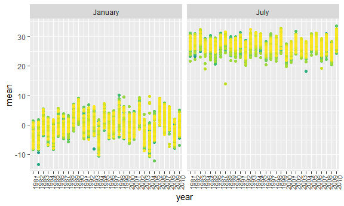

Homework 3
================
Jyoti Ankam
October 7, 2018

``` r
knitr::opts_chunk$set(
  fig.width = 6,
  fig.asp = .6,
  out.width = "90%"
)
```

Loading the tidyverse dataset and other relevant datasets-

``` r
library(tidyverse)
```

    ## -- Attaching packages --------------------------------------------------- tidyverse 1.2.1 --

    ## v ggplot2 3.0.0     v purrr   0.2.4
    ## v tibble  1.4.2     v dplyr   0.7.4
    ## v tidyr   0.8.0     v stringr 1.3.1
    ## v readr   1.1.1     v forcats 0.3.0

    ## -- Conflicts ------------------------------------------------------ tidyverse_conflicts() --
    ## x dplyr::filter() masks stats::filter()
    ## x dplyr::lag()    masks stats::lag()

``` r
library(p8105.datasets)

library(ggthemes)

library(patchwork)

library(hexbin)
```

Formatting the data to use appropriate variable names with a focus on the “Overall Health” topic and including only responses from “Excellent” to “Poor” while organizing responses as a factor taking levels from “Excellent” to “Poor”:

``` r
data("brfss_smart2010")
brfss_smart_df = brfss_smart2010 %>% 
  janitor::clean_names() %>% 
  filter(topic == "Overall Health") %>% 
  select(-(class:question), -sample_size, -(confidence_limit_low:geo_location)) %>% 
  mutate(response = forcats::fct_relevel(response, c("Excellent", "Very good", "Good", "Fair", "Poor"))) 
```

States that were observed at 7 locations are -

``` r
brfss_smart_df %>% 
  filter(year == 2002) %>% 
  group_by(locationdesc) %>%
  distinct(locationdesc) %>% 
  summarise(n = n()) %>% 
  filter(n == 7) %>% 
  knitr::kable()
```

locationdesc n ------------- ---

The states that were observed at 7 locations in 2002 are NC, CT and FL

``` r
brfss_smart_df %>%
  distinct(locationabbr, locationdesc, year) %>% 
  group_by(locationabbr, year) %>% 
  summarise(n = n()) %>% 
  ggplot(aes(x = year, y = n, color = locationabbr)) +
  geom_line() +
  theme(legend.position = "left") +
  labs(
    title = "Spaghetti plot",
    x = "Year",
    y = "Number of observed locations",
    caption = "BRFSS data - Year 2010"
  )
```


Making a “spaghetti plot” showing the number of locations in each state from 2002 to 2010. As we can see there was a sudden increase in the number of locations for one of the states. The number of locations for majority of the other states, however, remained stable.

Making a table showing the mean and standard deviation of the proportion of “Excellent” responses across locations in NY State for the years 2002, 2006, and 2010.

``` r
brfss_smart_df %>% 
  filter(year %in% c(2002, 2006, 2010) & locationabbr == "NY") %>% 
  spread(key = response, value = data_value) %>% 
  janitor::clean_names() %>% 
  group_by(locationabbr, year) %>% 
  summarise(n = n(),
            mean = mean(excellent),
            sd = sd(excellent)) %>% 
  knitr::kable()
```

| locationabbr |  year|    n|      mean|        sd|
|:-------------|-----:|----:|---------:|---------:|
| NY           |  2002|    5|  24.04000|  4.486424|
| NY           |  2006|    6|  22.53333|  4.000833|
| NY           |  2010|    9|  22.70000|  3.567212|

From the table, we can observe that the mean for proportion of excellent for the years 2006 and 2010 are very similar but worse than 2002. The standard deviation are not very different for 2002 and 2006.

In order to make the five panel plot showing the each of the response categories separately, we can first compute the average proportion in each response category for each year and state and then we can compute by taking the average across locations in a state. This way we can see the distribution of these state-level averages over time.

``` r
brfss_smart_df %>% 
  spread(key = response, value = data_value) %>% 
  janitor::clean_names() %>% 
  group_by(locationabbr, year) %>% 
  summarise(n = n(),
            mean_excellent = mean(excellent, na.rm = TRUE),
            mean_very_good = mean(very_good, na.rm = TRUE),
            mean_good = mean(good, na.rm = TRUE),
            mean_fair = mean(fair, na.rm = TRUE),
            mean_poor = mean(poor, na.rm = TRUE)) %>%
  gather(key = mean_name, value = mean_value, mean_excellent:mean_poor) %>% 
  ggplot(aes(x = year, y = mean_value, color = locationabbr)) +
  geom_line() +
  facet_grid(~mean_name)
```

 In this spagetti plot, we can observe that across the years, the proportion of very good has the highest mean while the lowest mean is for the proportion of the poor.

Problem 2:

Loading the dataset "instacart":

``` r
data("instacart")
```

Describing the dataset:

This dataset contains 1384617 observations and 15 variables. Variable 'order\_id' is a unique identifier of the orders that have been made. Also, we can observer that there are131209 distinct orders. Other variables like 'aisle', 'product\_name', and 'department\_name', have their own unique identifiers as well. Variables such as 'order\_dow' tell us about the day of the week the order was made and 'order\_hour\_of\_day' tell us the time the order was made.

Calculating the number of aisles, and also which aisles are the ones with the most items ordered from:

``` r
instacart %>% 
  distinct(aisle_id) %>% 
  count()
```

    ## # A tibble: 1 x 1
    ##       n
    ##   <int>
    ## 1   134

``` r
instacart %>% 
  group_by(aisle_id, aisle) %>% 
  summarise(number = n()) %>% 
  ungroup() %>% 
  top_n(5, number) %>% 
  arrange(desc(number)) %>% 
  knitr::kable()
```

|  aisle\_id| aisle                      |  number|
|----------:|:---------------------------|-------:|
|         83| fresh vegetables           |  150609|
|         24| fresh fruits               |  150473|
|        123| packaged vegetables fruits |   78493|
|        120| yogurt                     |   55240|
|         21| packaged cheese            |   41699|

Here, we can see that there are 134 aisles. Also, we get the top five most popular aisles with fresh vegetables the most popular. As evident from the plot, the aisle containing fresh vegetables is where the most orders come from.

Below is the plot showing the number of items ordered in each aisle.

``` r
instacart %>% 
  group_by(aisle_id, aisle) %>% 
  summarise(number = n()) %>% 
  arrange(desc(number)) %>% 
  mutate(aisle = tools::toTitleCase(aisle)) %>% 
  ggplot(aes(x = reorder(aisle, -number), y = number, fill = aisle)) +
  geom_col() +
  theme(axis.text.x = element_text(angle = 85, hjust = 1, size = 8),
        legend.position = "none") +
  labs(
    title = "Frequency distribution of aisle orders",
    x = "Aisle",
    y = "Number of orders",
    caption = "Instacart Data 2017"
  )
```


Below is the table showing the most popular item in aisles “baking ingredients”, “dog food care”, and “packaged vegetables fruits”

``` r
instacart %>% 
  select(aisle_id, aisle,product_id, product_name) %>% 
  filter( aisle == "baking ingredients" | aisle == "dog food care" | aisle == "packaged vegetables fruits") %>% 
  group_by(aisle, product_name) %>% 
  summarise(number = n()) %>% 
  top_n(1, number) %>% 
  arrange(desc(number)) %>% 
  knitr::kable()
```

| aisle                      | product\_name                                 |  number|
|:---------------------------|:----------------------------------------------|-------:|
| packaged vegetables fruits | Organic Baby Spinach                          |    9784|
| baking ingredients         | Light Brown Sugar                             |     499|
| dog food care              | Snack Sticks Chicken & Rice Recipe Dog Treats |      30|

The table show the most popular/top items in each of those aisles.

Below is the table showing the mean hour of the day at which Pink Lady Apples and Coffee Ice Cream are ordered on each day of the week

``` r
instacart %>% 
  filter(product_name == "Pink Lady Apples" ) %>% 
  group_by(order_dow, product_name) %>% 
  summarise(mean_hour = mean(order_hour_of_day)) %>% 
  spread(key = product_name, value = mean_hour) %>% 
  knitr::kable()
```

|  order\_dow|  Pink Lady Apples|
|-----------:|-----------------:|
|           0|          13.44118|
|           1|          11.36000|
|           2|          11.70213|
|           3|          14.25000|
|           4|          11.55172|
|           5|          12.78431|
|           6|          11.93750|

``` r
instacart %>% 
  filter(product_name == "Coffee Ice Cream" ) %>% 
  group_by(order_dow, product_name) %>% 
  summarise(mean_hour = mean(order_hour_of_day)) %>% 
  spread(key = product_name, value = mean_hour) %>% 
  knitr::kable()
```

|  order\_dow|  Coffee Ice Cream|
|-----------:|-----------------:|
|           0|          13.77419|
|           1|          14.31579|
|           2|          15.38095|
|           3|          15.31818|
|           4|          15.21739|
|           5|          12.26316|
|           6|          13.83333|

Problem 3: Installing the dataset -

``` r
data("ny_noaa")
```

Doing some data cleaning and creating separate variables for year, month, and day. Ensuring that the observations for temperature, precipitation, and snowfall are given in reasonable units (i.e. tenths of their units) by dividing by 10. For snowfall, calculating the most commonly observed values.

``` r
ny_noaa_df = ny_noaa %>% 
  mutate(month = months.Date(date),
         day = chron::days(date),
         year = chron::years(date),
         tmax = (as.numeric(tmax))/10,
         tmin = (as.numeric(tmin))/10,
         prcp = prcp/10)
```

This dataset contains 2595176 observations and 10 variables. There are variables decribing precipitation (prcp), maximum and minimum temperature (tmax and tmin), snow fall(snow) and snow depth (snwd). We can see 747 distinct stations recording all the various weather-related information from 1981 to 2010.

``` r
ny_noaa_df %>% 
  group_by(snow) %>% 
  summarise(number = n()) %>% 
  arrange(desc(number))
```

    ## # A tibble: 282 x 2
    ##     snow  number
    ##    <int>   <int>
    ##  1     0 2008508
    ##  2    NA  381221
    ##  3    25   31022
    ##  4    13   23095
    ##  5    51   18274
    ##  6    76   10173
    ##  7     8    9962
    ##  8     5    9748
    ##  9    38    9197
    ## 10     3    8790
    ## # ... with 272 more rows

As we can observe for snowfall, the most common observed values are 0 and NA. This is an obvious observation as it does not snow on most days in a year. Also, there might be stations in geographic locations having no snow fall and hence with no recordings.

Making a two-panel plot showing the average max temperature in January and in July in each station across years.

``` r
ny_noaa_df %>% 
  group_by(id, year, month) %>% 
  summarize(n = n(),
            sum = sum(tmax, na.rm = TRUE),
            mean = mean(tmax, na.rm = TRUE)) %>% 
  filter(month %in% c("January", "July")) %>% 
  ggplot(aes(x = year, y = mean, color = id)) +
  facet_grid(~month) + 
  geom_point() +
  theme(axis.text.x = element_text(angle = 85, hjust = 1, size = 8),
        legend.position = "none") +
  viridis::scale_color_viridis(
    name = "location", 
    discrete = TRUE) 
```

    ## Warning: Removed 5970 rows containing missing values (geom_point).



It is evident that there are higher temperatures in July as compared to January, as expected. There are a a couple of outliers in some of the years.

Making a two-panel plot showing (i) tmax vs tmin for the full dataset and (ii) making a plot showing the distribution of snowfall values greater than 0 and less than 100 separately by year.

``` r
ny_noaa_df %>% 
  filter(month %in% c("January", "July")) %>% 
  ggplot(aes(x = year, y = tmax, color = year)) +
  facet_grid(~month) +
  geom_boxplot() +
  theme(axis.text.x = element_text(angle = 85, hjust = 1, size = 8),
      legend.position = "none")
```

    ## Warning: Removed 190331 rows containing non-finite values (stat_boxplot).


``` r
hex = ggplot(ny_noaa_df, aes(x = tmin, y = tmax)) +
  geom_hex(aes()) +
  theme(axis.text.x = element_text(angle = 85, hjust = 1, size = 8),
      legend.position = "none")

my_boxplot = ny_noaa_df %>% 
  filter(snow > 0 & snow < 100) %>% 
  ggplot(aes(x = year, y = snow, fill = year)) +
  geom_boxplot(alpha = 0.3) +
  theme(axis.text.x = element_text(angle = 85, hjust = 1, size = 8),
        legend.position = "none")

hex / my_boxplot
```

    ## Warning: Removed 1136276 rows containing non-finite values (stat_binhex).


The hexagonal heat map shows the distribution of the pairs of tmax and tmin. From the box plot, we can observe that there is more variability in snowfall in the last ten years compared to first ten years. Additionally, there are more outliers in the last ten years compared to the first ten years.
